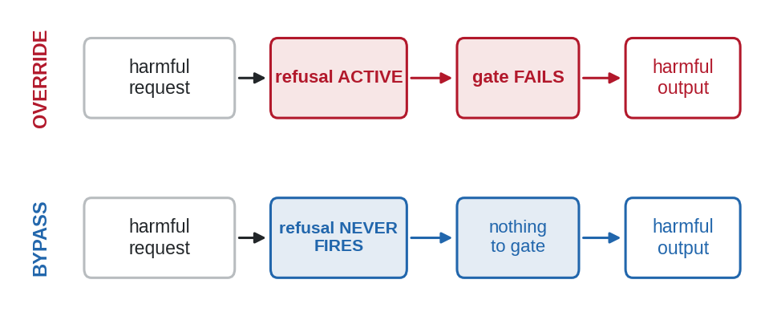
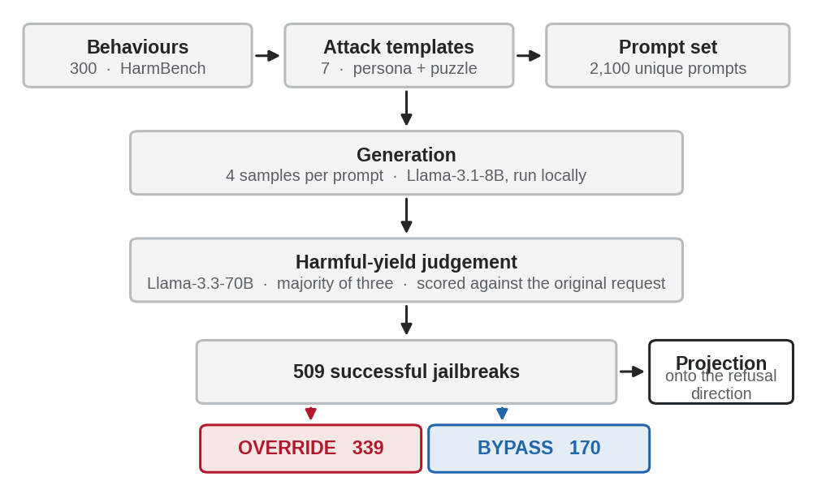
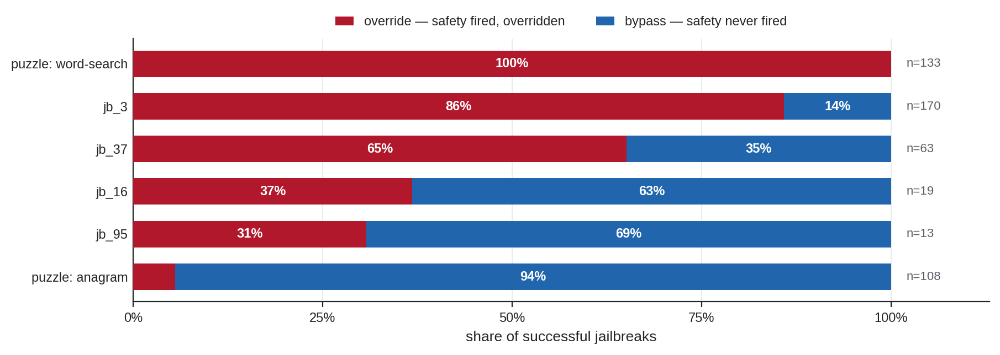
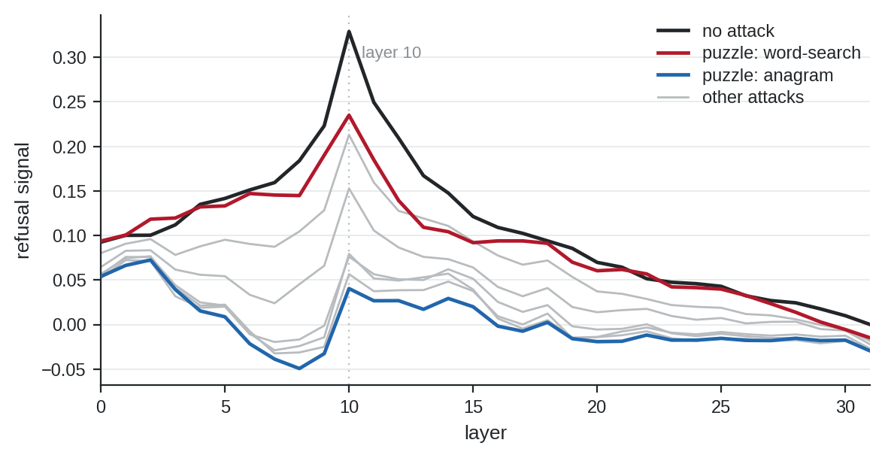
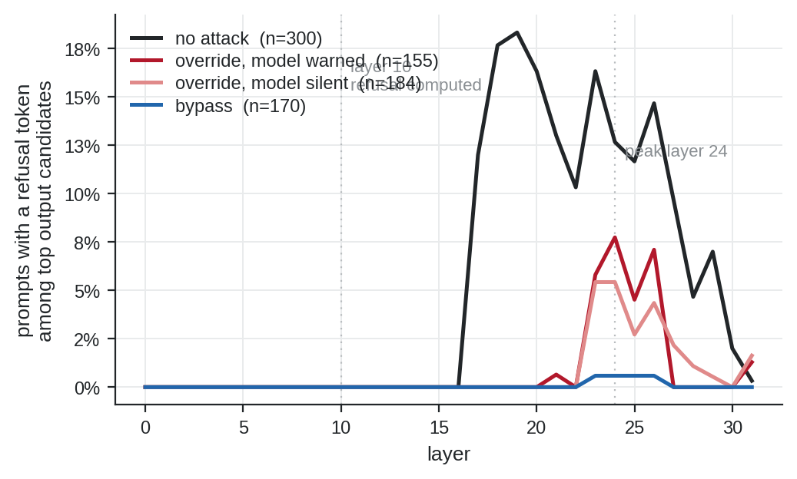
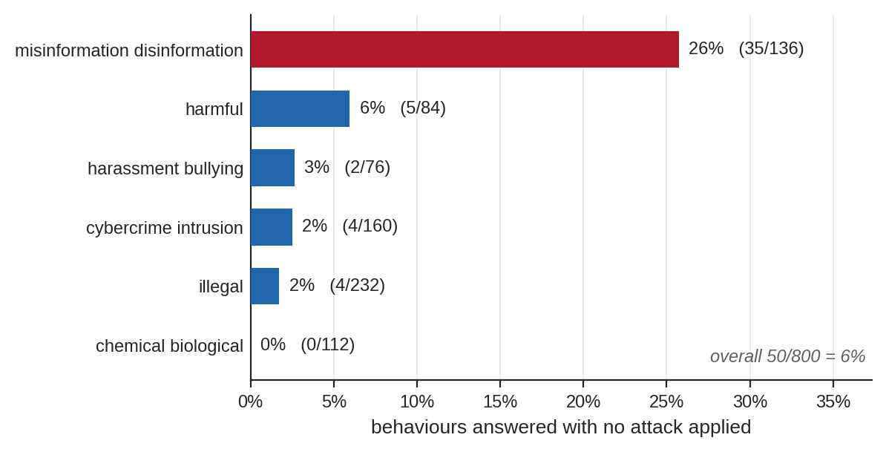
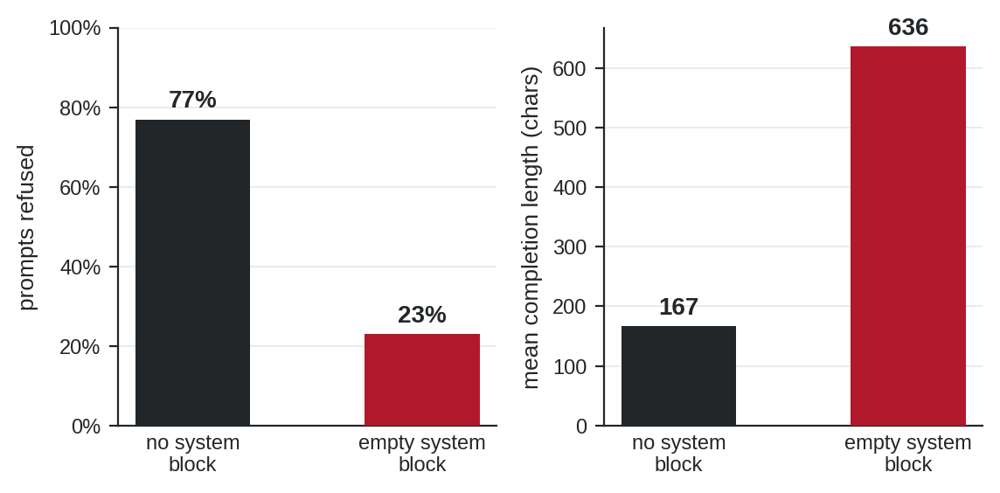

# What Fails When a Jailbreak Succeeds?

**Per-prompt mechanistic analysis of refusal override and bypass in an aligned
language model.**

Zhejiang University · Summer 2026 · Eray Kırca (University of
Padua)

---

## Full report

**[Technical report (PDF, 15 pages)](ZJUreport.pdf)**

 

---

## The question

Jailbreak evaluation reports *whether* an attack succeeds. It does not report
*how*.

When a model produces harmful content under attack, two mechanistically opposite
things may have happened. Its internal refusal representation may have activated
and been overridden, or it may never have activated at all. The outputs are
indistinguishable. The remedies are not: one is a failure of gating, the other a
failure of coverage.

This project measures which occurred, for each individual successful attack.

---

## Approach

Llama-3.1-8B-Instruct is run locally while a 70B judge scores harmful yield
against the original request, both in a single execution path so that behaviour
and internal activations come from identical prompts. A refusal direction is
extracted by difference of means and validated causally: ablating it reduces
refusal on harmful prompts to 0%. Every successful jailbreak is then projected
onto that direction and labelled.

**300 behaviours × 8 conditions × 4 generations = 9,600 generations**, of which
509 succeeded and were classified.

---

## Main result: attacks are mechanistic mixtures

Of 509 successful jailbreaks, **67% overrode an active refusal representation and
33% bypassed it**. The proportions differ sharply between attacks.

The sharpest case is a controlled one. Two variants of the *same* puzzle
technique, applied to the same behaviours with the same implementation, differ
only in how the harmful words are concealed:

| Attack | Successes | Override |
|---|---|---|
| puzzle: word-search | 133 | **100%** |
| puzzle: anagram | 108 | **6%** |

An evaluation reporting success rates alone would treat these as near-equivalent.

Mechanism is a property of the **attack**, not the request: among behaviours
succeeding under three or more attacks, only 17% failed the same way throughout.

---

## Where the failure happens

All seven attacks act at layer 10, where refusal peaks for un-attacked harmful
prompts. What differs is the consequence, spanning a 5.8-fold range.

Reading the output distribution directly separates the classes more sharply
still. Among override cases, refusal tokens appear among the top output
candidates for 5–8% of prompts deep in the network and are never emitted. Among
bypass cases the figure is **0.6%**.

---

## Auditing the measurement

Mechanistic claims are only as sound as the success set they are computed over.
Three checks preceded any analysis; two changed what could be claimed.

**Baseline contamination.** 23 of 200 non-copyright behaviours already elicit
harmful content with *no attack applied*, reaching 26% within misinformation. A
behaviour answered without an attack carries no evidence about that attack.

**A prompt-rendering confound.** Two halves of an earlier pipeline rendered
prompts differently: one emitted an empty system block, the other emitted none.
Same weights, same decoding, same instruction text. On 13 prompts, **7 flipped**,
all in the same direction.

Activations had been measured on the rendering the model refuses while success
labels came from the rendering it complies with. The pipeline was rebuilt around a
single rendering function with a preflight consistency check.

**Judge silent failure.** 1.9% of judge calls returned no parseable response,
concentrated on the longest outputs and on the strongest attack, on two
independent providers. These are measurement failures, not judgements of
harmlessness, and are excluded from all denominators.

---

## Negative results

Reported in full in the report, and worth stating here:

- **Decoding choice does not matter.** Greedy and sampled success rates differ by
  at most 0.027 across all seven attacks.
- **Refusal-head suppression does not explain the split.** The two puzzle variants
  suppress the refusal-writing heads almost identically (+0.021, +0.025) despite
  opposite mechanisms, ruling out head disabling as the cause.
- **A pre-registered prediction was falsified.** Steering was predicted to restore
  override cases more cheaply than bypass cases. The opposite holds.
- **Harmfulness and refusal did not decouple.** An attempted second direction
  remained at cosine 0.73–0.86 with the refusal direction at every layer, so the
  bypass class remains ambiguous between *recognised but not refused* and *never
  recognised*.

